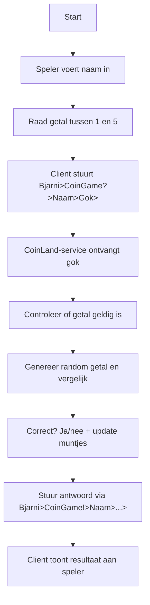
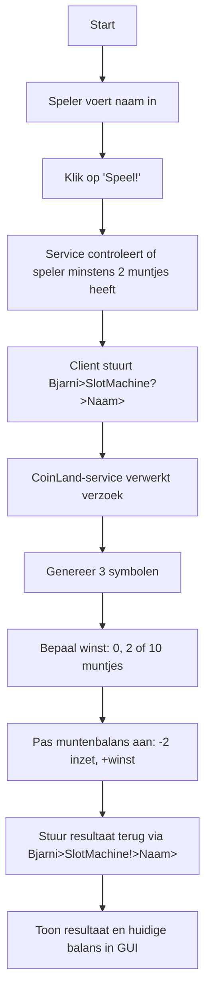
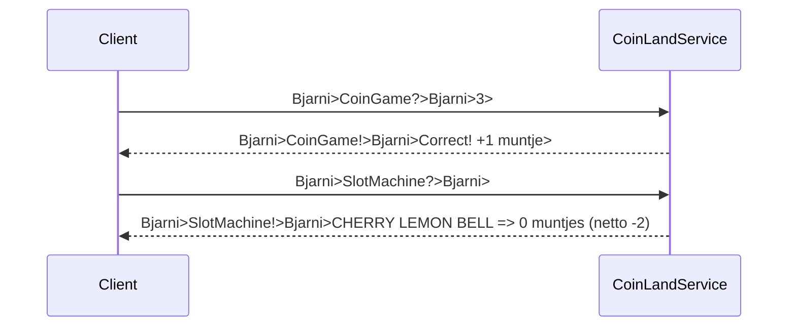

# CoinLand Project - Eén gecombineerde service met GUI-client

Welkom bij **CoinLand**! Dit project bestaat uit één gecombineerde service met twee ZeroMQ-gebaseerde minigames:

- **CoinGame** – Raad een getal tussen 1 en 5 en verdien muntjes (mits correcte gok).
- **SlotMachine** – Betaal 2 muntjes per draai, win tot 10 muntjes op basis van symbolencombinatie.

Beide spellen delen een **gezamenlijke muntenbalans per spelernaam**, waardoor er één consistente spelervaring is.

---

## Overzicht

Spelers communiceren via ZeroMQ (PUSH/SUB) met de CoinLand-service die op Benternet draait. De speler:

1. Voert zijn naam in via de GUI-client.
2. Stuurt een verzoek naar CoinGame of SlotMachine.
3. Krijgt een gepersonaliseerd antwoord via de SUB-socket met muntjesupdate.

Alle muntjes worden per spelernaam bijgehouden in een `unordered_map<std::string, int>` aan de servicezijde.

---

## CoinGame Flow



---

## SlotMachine Flow



---

## Naam & Muntjesbeheer

De gecombineerde service gebruikt:

- Eén `unordered_map<std::string, int>` om de muntjes per speler bij te houden.
- Muntjes zijn persistent zolang de service draait.
- Spelers moeten dus **dezelfde naam hergebruiken** voor continuïteit.

---

## Communicatieschema



---

## Bestandsoverzicht

- `coinland_service.cpp` – C++ gecombineerde CoinGame + SlotMachine service
- `coinland_gui_client.py` – Python GUI-client voor beide spellen
- Optioneel: testscript, documentatie, oudere versies

---

## Uitvoeren

```bash
# CoinLand service starten (na compilatie)
./coinland_service.exe

# GUI-client starten
python coinland_client.py
```

---

## Auteurs

- Bjarni Heselmans – Project voor Network Programming – Benternet
