# 🎰 CoinLand Project - CoinGame & SlotMachine over Benternet

Welkom bij **CoinLand**! Dit project bevat twee ZeroMQ-gebaseerde minigames die draaien over het Benternet-netwerk:

- **CoinGame** – Raad een getal tussen 1 en 5 en verdien muntjes.
- **SlotMachine** – Draai drie symbolen en win muntjes op basis van combinaties.

Beide games delen dezelfde **spelersnaam** en **muntjesbalans**, waardoor er één geïntegreerde spelervaring ontstaat. 

---

## Overzicht

Spelers communiceren via ZeroMQ met de services die op het Benternet draaien. De speler:

1. Voert zijn naam in.
2. Stuurt een verzoek naar een van de services.
3. Krijgt een gepersonaliseerd antwoord terug met resultaat én muntjesupdate.

Muntjes worden bijgehouden **per naam**, en bestaan alleen in de service-geheugenruimte (later uitbreidbaar met opslag).

---

## CoinGame Flow


## SlotMachine Flow


## Gemeenschappelijk gebruik van naam & muntjes
Beide services houden per spelernaam de muntjes bij in een std::unordered_map<std::string, int>. Dit betekent:
- Elke service onthoudt lokaal de muntjesstand van spelers.
- Dezelfde naam = dezelfde speler (in beide spellen).
- Spelers kunnen dus muntjes winnen in CoinGame en gebruiken in SlotMachine (of omgekeerd).

## Communicatieschema

```mermaid
sequenceDiagram
    participant Client
    participant CoinGameService
    participant SlotMachineService

    Note over Client,CoinGameService: CoinGame-protocol
    Client->>CoinGameService: Bjarni>CoinGame?>Bjarni>4>
    CoinGameService-->>Client: Bjarni>CoinGame!>Bjarni>Correct! +1 muntje>

    Note over Client,SlotMachineService: SlotMachine-protocol
    Client->>SlotMachineService: Bjarni>SlotMachine?>Bjarni>
    SlotMachineService-->>Client: Bjarni>SlotMachine!>Bjarni>🍒 🍒 🍋 => 2 muntjes>
```


## Bestandsoverzicht
- coingame_service.cpp – C++ CoinGame-server
- slotmachine_service.cpp – C++ SlotMachine-server
- coingame_client.cpp – CLI-client voor CoinGame
- slotmachine_gui_client.py – GUI-client in Python voor SlotMachine

## Uitvoeren
```bash
# CoinGame server starten
./coingame_service

# SlotMachine server starten
./slotmachine_service

# CoinGame client starten (C++)
./coingame_client //Komt nog GUI voor

# SlotMachine GUI starten (Python)
python slotmachine_gui_client.py
```

## Auteurs
Bjarni Heselmans - Project voor Network Programming - Benternet
